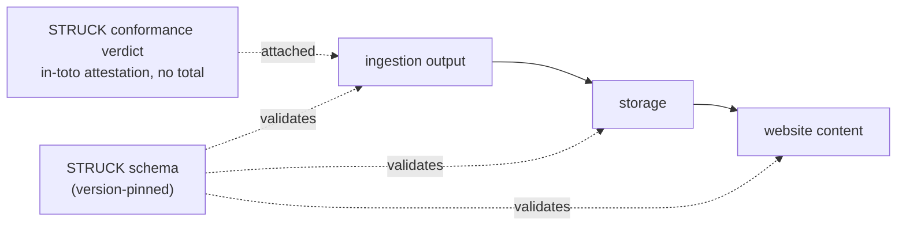

# STRUCK as a machine-readable contract

A short read for engineers deciding whether this is the shape they want.

## The problem this addresses

A big standards document has a probabilistic-interpretation problem: give the same prose to a thousand agents and you get a thousand interpretations. The fix is to move the reliability off the prose and onto a schema an agent validates against, a strict, version-pinned contract that is either satisfied or not. That is what this directory is: the STRUCK standard, expressed as machine-readable contracts.

## What STRUCK is, in one line

STRUCK is the exit-boundary standard: what an evidence-grade output owes on its face so a reader, or an agent, can check it rather than take it or leave it. Its object is an `EvidenceGradeOutput` carrying five obligations (graded evidence, refutation conditions, contested regions, derivation chains to origin, and the worth-judgment left to the consumer).

## One source, every format

The prose standard and the machine-readable schema come from one source, neither a byproduct of the other (the FHIR pattern). One LinkML model generates the JSON Schema, the Zod, the JSON-LD context, SHACL, OWL, and GraphQL, plus a conformance verdict and a SARIF findings run. Edit the standard, regenerate, and every format moves together. Nothing is hand-maintained, so no format can silently fall behind the standard.

## How it fits an ingestion pipeline

STRUCK is the contract for an evidence-grade output. Wherever such an output crosses a seam of the pipeline, the same version-pinned schema validates it, and a per-obligation conformance verdict rides along as an attestation.

The Zod (`dist/struck.zod.ts`) is the runtime source of truth for a TypeScript pipeline; the JSON Schema is the language-neutral contract; the JSON-LD and SHACL are for the graph side. The verdict is a per-obligation attestation with deliberately no aggregate score, so no single tunable number stands in for the profile.

## What the schema does and does not decide

STRUCK's obligations split. Some are **shape**: a schema can enforce that the grade profile is present per dimension, that derivation chains are labeled by role, that no combined-confidence field exists. Some are **judgment**: whether a refutation condition is genuinely stated in world terms, whether a rung is presented above its standing. The register (`src/struck-register.yaml`) marks each obligation as shape, judgment, or mixed. The schema enforces the shape; the judgment obligations are the conformance checker's, and this directory is honest about that line rather than pretending a schema settles it.

## Where this goes next

STRUCK is the first standard through this pipeline; the same one-source-generate approach applies to the rest of the family (ORE at the input boundary, CRAFT for the evaluation chain, CROSS and WALKRI for rounds and instrumentation). The point of proving it on STRUCK is that the shape and the tooling are settled, so the others follow the same path.
