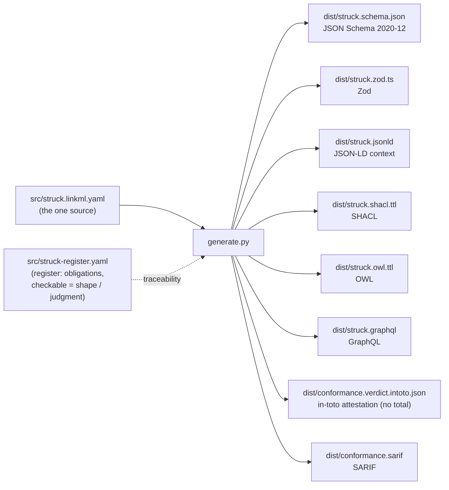

# STRUCK, machine-readable

Machine-readable artifacts for the STRUCK standard (`struck-0_1_0`, v0.1.2, CC0), the exit-boundary standard for what an evidence-grade output owes on its face. Every artifact here is **generated from one source**, never hand-edited, so the schema an agent validates against cannot drift from the standard.

If you only want the file to validate against, it is [`dist/struck.schema.json`](dist/struck.schema.json) (JSON Schema 2020-12) or [`dist/struck.zod.ts`](dist/struck.zod.ts) (Zod). For why this exists and how it fits an ingestion pipeline, see [EXPLAINER.md](EXPLAINER.md).

## The pipeline



One LinkML model generates the schema and semantic tier; thin adapters in `generate.py` carry what LinkML does not (pin the JSON Schema draft and the `$id`; emit Zod from the dereferenced schema; project the conformance verdict to in-toto and SARIF). The register (`src/struck-register.yaml`) marks each of STRUCK's obligations as **shape** (a schema can enforce it), **judgment** (a reader must assess it), or **mixed**, which is why the schema is not the whole of conformance.

## What each artifact is, and who consumes it

| Artifact | Format | Consumer |
|---|---|---|
| `dist/struck.schema.json` | JSON Schema 2020-12 | any validator; the canonical contract |
| `dist/struck.zod.ts` | Zod / TypeScript | runtime validation in a TS pipeline; a source of truth for agents |
| `dist/struck.jsonld` | JSON-LD context | linked-data / graph ingestion |
| `dist/struck.shacl.ttl` | SHACL shapes | validating STRUCK data expressed as RDF |
| `dist/struck.owl.ttl` | OWL | ontology alignment |
| `dist/struck.graphql` | GraphQL SDL | schema-first APIs / indexers |
| `dist/conformance.verdict.intoto.json` | in-toto Statement | a per-obligation conformance verdict, deliberately with **no total field** |
| `dist/conformance.sarif` | SARIF 2.1.0 | a findings run: one result per obligation |

## Regenerate

```
python -m venv venv && ./venv/bin/pip install -r requirements.txt
./venv/bin/python generate.py        # regenerate dist/ from src/
./venv/bin/python tests/validate.py  # the conformant example validates; the non-conformant one must fail
```

`tests/validate.py` runs against the generated JSON Schema with a standard validator (the conditional obligations are enforced there, not through LinkML), and every non-conformant fixture in `examples/` must fail. That is the guard against a silently-broken schema.

## Provenance

Generated from the STRUCK standard, `github.com/CrossWalkri/STRUCK` (`struck-0_1_0.md`). STRUCK inherits ORE and CRAFT by reference. Specification CC0 1.0.
